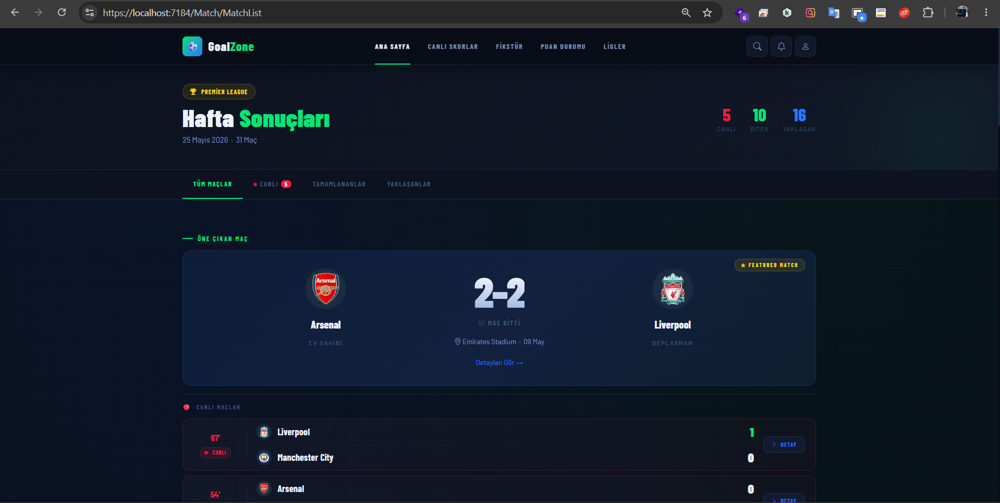
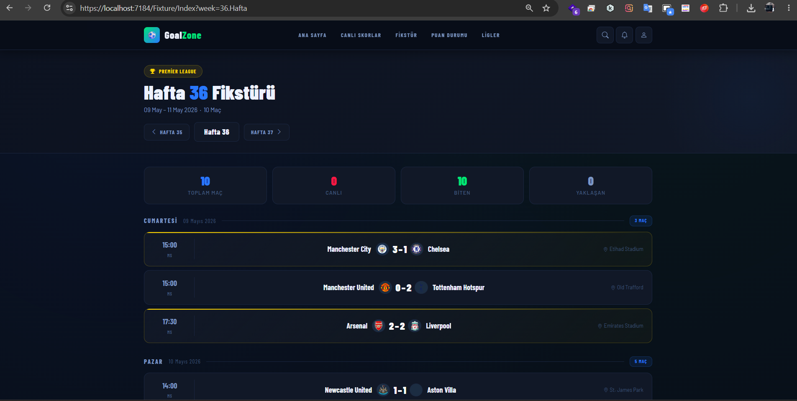
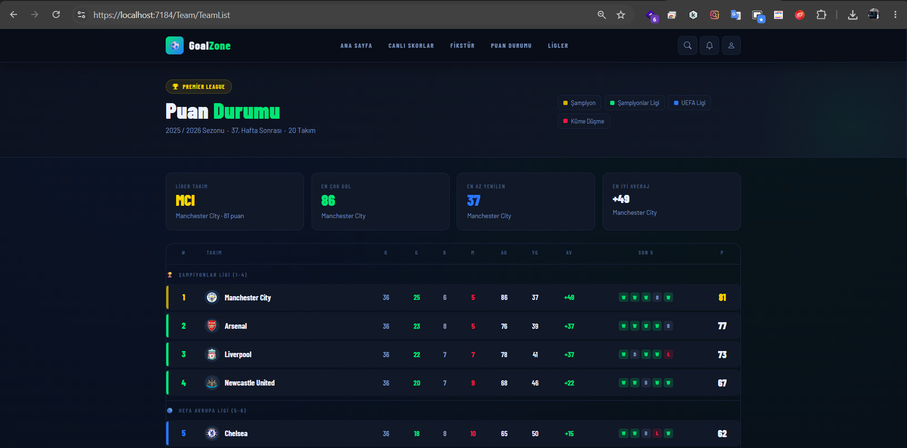

# ⚽ GoalZone Premier League

> Full-stack bir Premier League maç takip ve istatistik platformu.


---

## 📸 Ekran Görüntüleri

| Ana Sayfa | Fikstür | Puan Durumu |
|-----------|---------|-------------|
|  |  |  |

---

## 🏗️ Proje Mimarisi

```
GoalZonePremierLig/
├── GoalZonePremierLig.Web.Api/     # ASP.NET Core Web API
│   ├── Controllers/                # API endpoint'leri
│   ├── Entities/                   # Veritabanı entity'leri
│   ├── Dtos/                       # Data Transfer Object'ler
│   ├── Mapping/                    # AutoMapper profilleri
│   └── Context/                    # EF Core DbContext
│
└── GoalZonePremierLig.UI/          # ASP.NET Core MVC
    ├── Controllers/                # UI controller'ları
    ├── Views/                      # Razor view'ları
    ├── Services/                   # HTTP servis katmanı
    └── Dtos/                       # UI tarafı DTO'lar
```

---

## 🚀 Özellikler

### 📊 Maç Yönetimi
- Canlı, tamamlanan ve yaklaşan maçları listeleme
- Maç detay sayfası (olaylar, istatistikler, kadro)
- Öne çıkan maç sistemi

### 📅 Fikstür
- Haftalık fikstür görünümü
- Hafta bazlı navigasyon (önceki/sonraki hafta)
- Maç özet kartları

### 🏆 Puan Durumu
- 20 takımlı Premier League tablosu
- Şampiyonlar Ligi / UEFA / Küme düşme renk göstergeleri
- Son 5 maç form takibi

### 📈 Maç İstatistikleri
- Topa sahip olma, şut, pas, korner, faul, ofsayt
- İki takım karşılaştırmalı bar gösterimi
- Sarı/kırmızı kart takibi

### ⚙️ Admin Paneli
- Yeni maç ekleme formu
- Maç istatistikleri ekleme/güncelleme

---

## 🛠️ Kullanılan Teknolojiler

| Katman | Teknoloji |
|--------|-----------|
| Backend API | ASP.NET Core 8 Web API |
| UI | ASP.NET Core 8 MVC |
| ORM | Entity Framework Core 8 |
| Veritabanı | Microsoft SQL Server |
| Mapping | AutoMapper |
| Frontend | Bootstrap 5.3, Bootstrap Icons |
| Font | Barlow / Barlow Condensed |

---

## ⚙️ Kurulum

### Gereksinimler
- .NET 8 SDK
- SQL Server (LocalDB veya MSSQL)
- Visual Studio 2022 veya VS Code

### Adımlar

**1. Repoyu klonlayın**
```bash
git clone https://github.com/kullaniciadi/GoalZonePremierLig.git
cd GoalZonePremierLig
```

**2. Veritabanı bağlantısını ayarlayın**

`GoalZonePremierLig.Web.Api/appsettings.json` dosyasını düzenleyin:
```json
{
  "ConnectionStrings": {
    "GoalZoneDb": "Server=YOUR_SERVER;Database=GoalZoneDb;Trusted_Connection=true;TrustServerCertificate=true;"
  }
}
```

**3. Migration çalıştırın**
```bash
cd GoalZonePremierLig.Web.Api
dotnet ef database update
```

**4. Seed data ekleyin**

`SeedData.sql` dosyasını SSMS'de çalıştırın.

**5. Projeyi başlatın**

Visual Studio'da her iki projeyi de başlatmak için:
- Solution'a sağ tıklayın → Properties
- Multiple Startup Projects → Her ikisini **Start** olarak ayarlayın
- F5

---

## 📡 API Endpoint'leri

### Fixtures
| Method | Endpoint | Açıklama |
|--------|----------|----------|
| GET | `/api/Fixture` | Tüm fikstürler |
| GET | `/api/Fixture/GetByWeek?week=37.Hafta` | Haftalık fikstür |
| GET | `/api/Fixture/GetWeekSummary?week=37.Hafta` | Hafta özeti |
| POST | `/api/Fixture/Create` | Yeni maç ekle |
| GET | `/api/Fixture/GetTeams` | Takım listesi |

### Match
| Method | Endpoint | Açıklama |
|--------|----------|----------|
| GET | `/api/Match` | Tüm maçlar |
| GET | `/api/Match/detail/{id}` | Maç detayı |

### Statistics
| Method | Endpoint | Açıklama |
|--------|----------|----------|
| GET | `/api/MatchStatistic/GetByFixture/{id}` | Maç istatistikleri |
| POST | `/api/MatchStatistic/Create` | İstatistik ekle |

### Standings
| Method | Endpoint | Açıklama |
|--------|----------|----------|
| GET | `/api/Standing` | Puan durumu |

---

## 🗄️ Veritabanı Şeması

```
Teams           → Takım bilgileri (isim, logo, stadyum)
Players         → Oyuncu bilgileri (gol, asist, pozisyon)
Fixtures        → Maç bilgileri (skor, durum, hafta)
MatchEvents     → Maç olayları (gol, kart, değişiklik)
MatchStatistics → Maç istatistikleri (pas, şut, korner)
Standings       → Puan durumu (puan, averaj, form)
```

---
